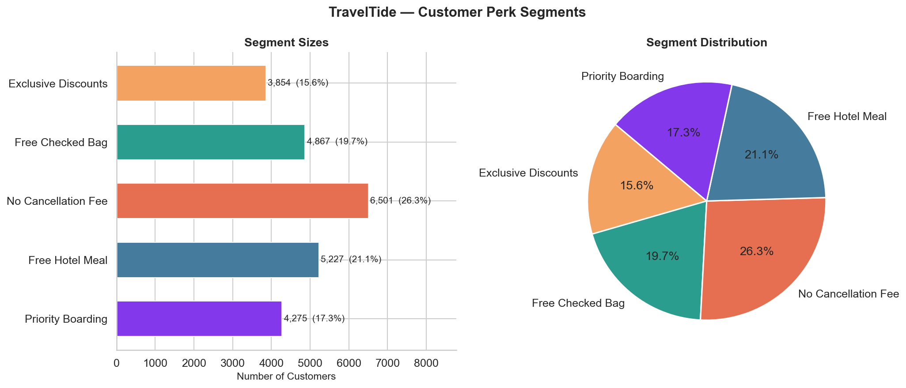
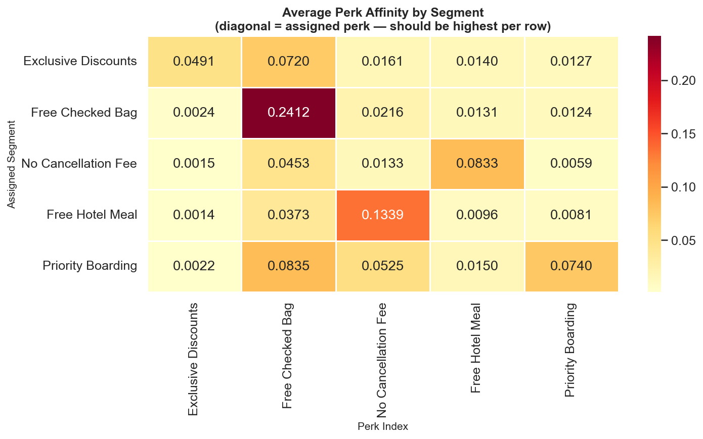
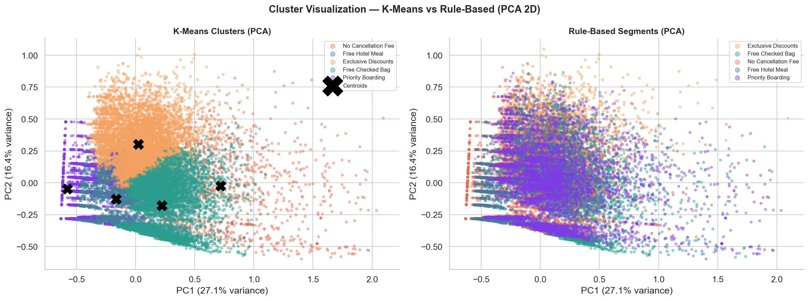
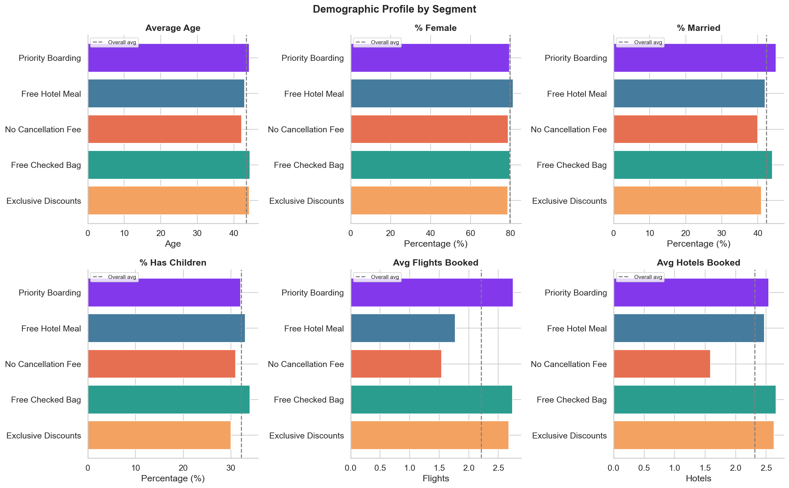
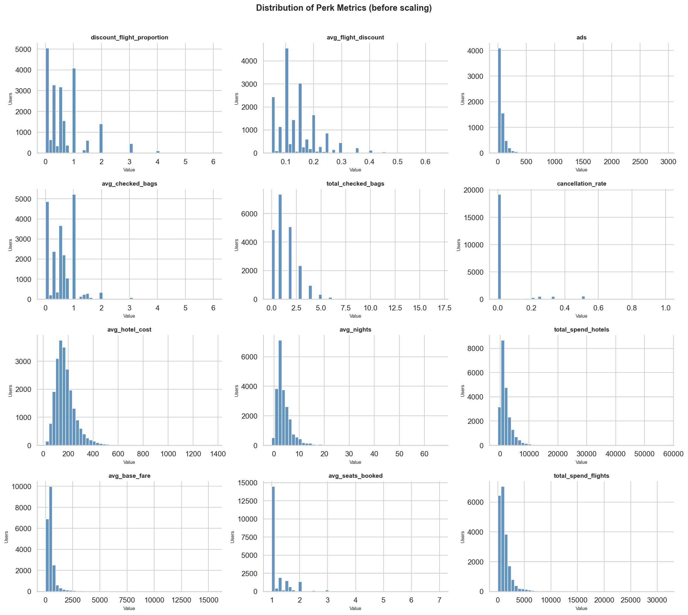
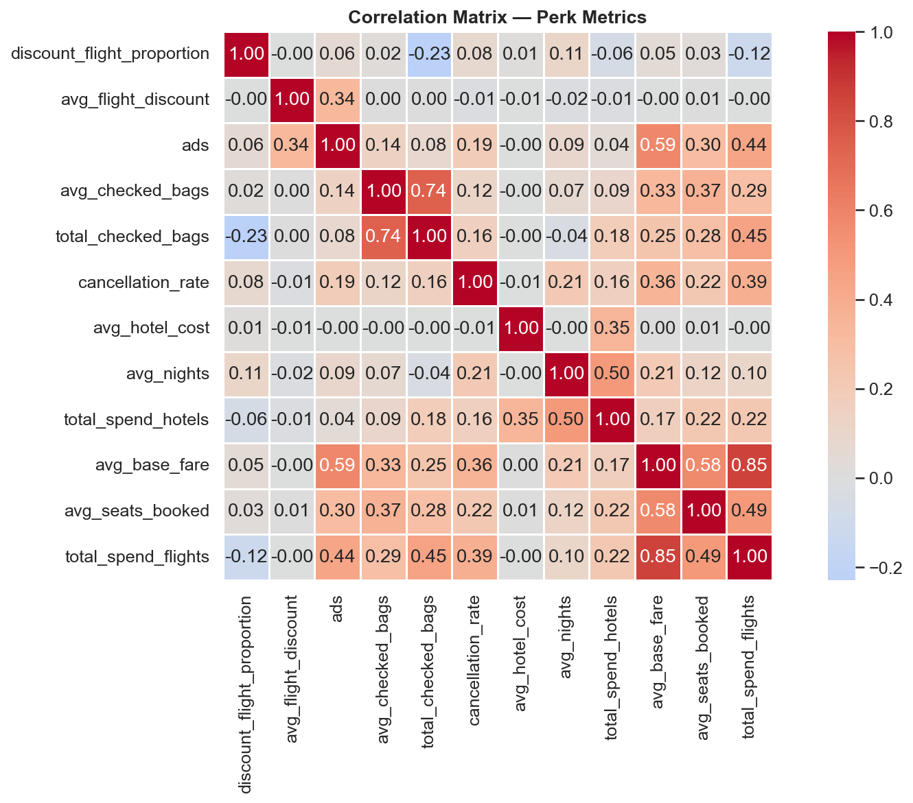
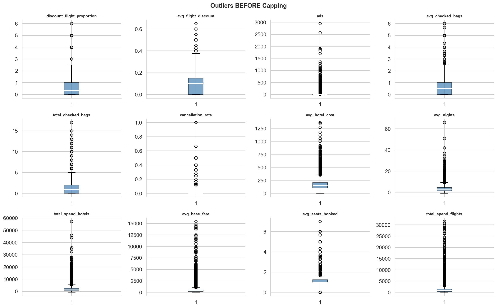
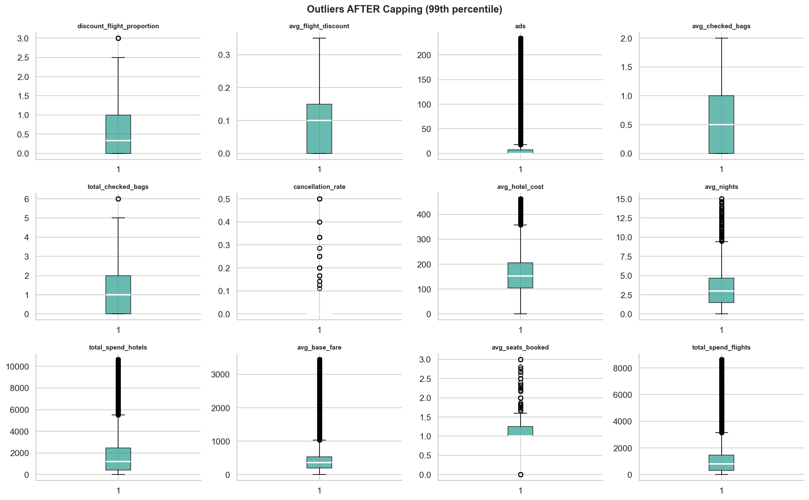
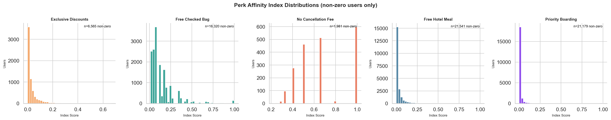
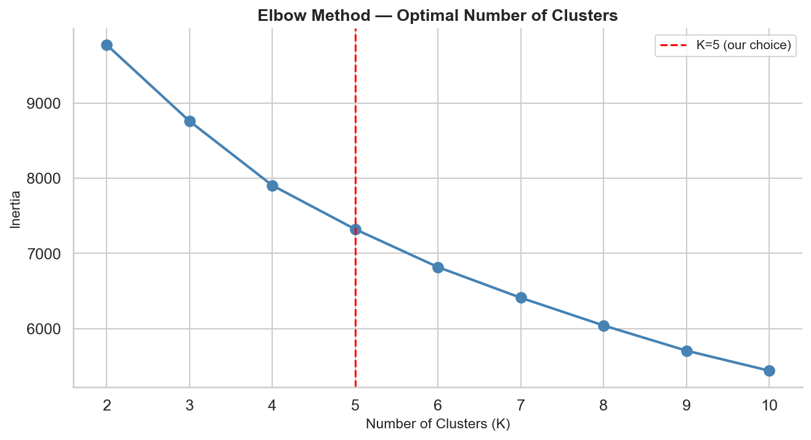

# TravelTide — Customer Perk Segmentation


[](https://traveltide-customer-segmentation-ak.streamlit.app/)

## Business Context
TravelTide is a travel booking platform launching a personalized rewards program.
The goal is to assign each customer to exactly **one perk** they are most likely
to respond to, based on their past booking behavior.

## The 5 Perks
| Perk | Target Customer |
|------|----------------|
| 🏷️ Exclusive Discounts | Customers who actively hunt for flight deals |
| 🧳 Free Checked Bag | Customers who consistently check bags |
| ❌ No Cancellation Fee | Customers who cancel or change trips frequently |
| 🍽️ Free Hotel Meal | Customers who spend heavily on hotels |
| 🛫 Priority Boarding | Customers who book premium high-fare flights |

## Dataset
- **Source:** TravelTide PostgreSQL database
- **Tables used:** `sessions`, `flights`, `hotels`, `users`
- **Cohort:** 24,724 users with 7+ sessions after January 4, 2023

---

## Results

### Customer Perk Segments


### Segment Validation — Affinity Heatmap


### K-Means vs Rule-Based — PCA Cluster Visualization


### Demographic Profile by Segment


---

## Methodology

### 1. SQL Cohort Extraction
Cohort defined as users with at least 7 sessions after January 4, 2023.
Metrics extracted by joining sessions, flights, hotels and users tables.

### 2. Exploratory Data Analysis



### 3. Feature Engineering — Outlier Handling



### 4. Perk Affinity Indexes


### 5. Rule-Based Fuzzy Segmentation
- Ranked all customers per perk index
- Assigned each customer to their strongest perk
- Result: mutually exclusive segments, zero unassigned

### 6. K-Means Clustering (K=5)


- Validated K=5 using elbow method
- Compared K-Means assignments to rule-based
- Rule-based recommended for this business problem

---

## Final Segment Summary

| Perk | Customers | Share |
|------|-----------|-------|
| 🏷️ Exclusive Discounts | 3,854 | 15.6% |
| 🧳 Free Checked Bag | 4,867 | 19.7% |
| ❌ No Cancellation Fee | 6,501 | 26.3% |
| 🍽️ Free Hotel Meal | 5,227 | 21.1% |
| 🛫 Priority Boarding | 4,275 | 17.3% |

---

## Project Structure
```
traveltide-customer-segmentation/
├── data/
│   └── traveltide_cohort.csv
├── notebooks/
│   └── traveltide_segmentation.ipynb
├── outputs/
│   ├── eda_distributions.png
│   ├── eda_correlation.png
│   ├── outliers_before.png
│   ├── outliers_after.png
│   ├── perk_index_distributions.png
│   ├── elbow_plot.png
│   ├── segment_sizes.png
│   ├── validation_heatmap.png
│   ├── cluster_visualization_pca.png
│   ├── segment_profiles.png
│   └── traveltide_final_segments.csv
├── pyproject.toml
└── README.md
```

## How to Run
```bash
# Clone the repository
git clone https://github.com/Akakinad/traveltide-customer-segmentation.git
cd traveltide-customer-segmentation

# Install dependencies
uv sync

# Register Jupyter kernel
uv run python -m ipykernel install --user --name=traveltide-customer-segmentation --display-name "TravelTide (uv)"

# Open notebook in VSCode and select "TravelTide (uv)" kernel
```

## Author
**Akinade**
[GitHub](https://github.com/Akakinad)